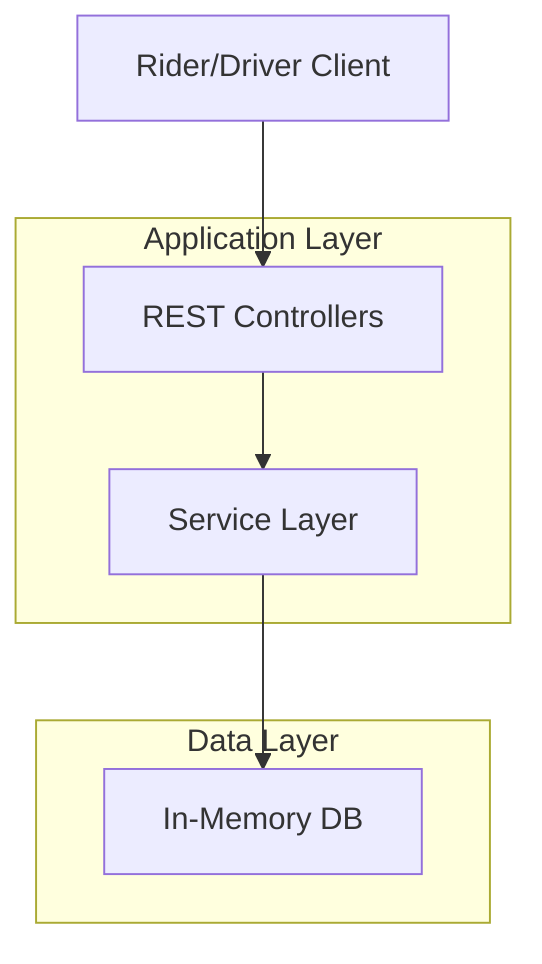

# Cab Booking Backend

A robust Spring Boot application for managing cab bookings, riders, and drivers with real-time location tracking and in-memory storage.

## 🏗 Architecture View

### System Components
The application follows a standard layered architecture with a decoupled in-memory database component.



### Data Flow
1. **Registration**: Riders and Drivers register via API.
2. **Location Update**: Drivers continuously update their coordinates.
3. **Booking**: A Rider requests a cab. The system filters available drivers within range and assigns the closest one.
4. **Trip Management**: Rides are tracked from start to completion.

---

## ✨ Features

- **User Management**: Register and manage Riders and Drivers.
- **Location Tracking**: Real-time updates for Driver locations.
- **Availability Toggle**: Drivers can switch their availability status.
- **Smart Booking**: Find and book the nearest available cab.
- **Ride History**: Access previous ride details for any rider.
- **Trip Lifecycle**: Handle booking, starting, and ending trips.

---

## 🛠 Tech Stack

- **Java 17+**
- **Spring Boot 3.x**
- **Lombok** (Boilerplate reduction)
- **Gradle** (Build tool)
- **In-Memory Storage** (HashMaps for fast access)

---

## 📂 Project Structure

```text
src/main/java/com/example/Test/
├── controllers/    # API Endpoints (Driver, Riders)
├── models/         # Data Transfer Objects & Entities
├── service/        # Business Logic Interfaces
│   └── serivceImpl/ # Service Implementations
└── db/             # Data Access (InMemoryDB)
```

---

## 🚀 API Endpoints

### Riders
| Method | Endpoint | Description |
| :--- | :--- | :--- |
| `POST` | `/riders` | Register a new rider |
| `GET` | `/riders/{id}/history` | Get ride history for a rider |
| `POST` | `/riders/{id}/book` | Book a cab from a location |
| `POST` | `/riders/{id}/end-trip` | End a ride |

### Drivers
| Method | Endpoint | Description |
| :--- | :--- | :--- |
| `POST` | `/drivers` | Register a new driver |
| `PUT` | `/drivers/{id}/location` | Update driver's current location |
| `PUT` | `/drivers/{id}/availability` | Toggle driver's availability |

---

## 🛠 Setup and Installation

1. **Clone the repository**:
   ```bash
   git clone <repository-url>
   cd cab-backend
   ```

2. **Build the project**:
   ```bash
   ./gradlew build
   ```

3. **Run the application**:
   ```bash
   ./gradlew bootRun
   ```

The application will start on `http://localhost:8080`.
